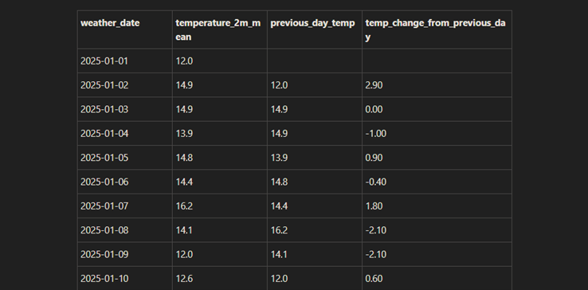
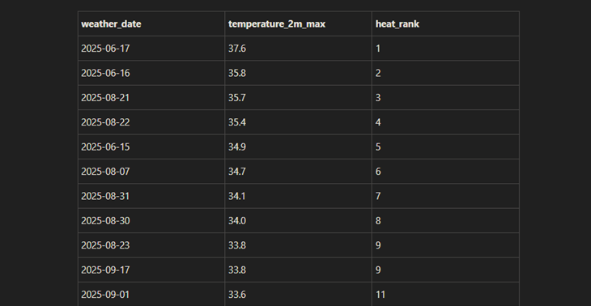
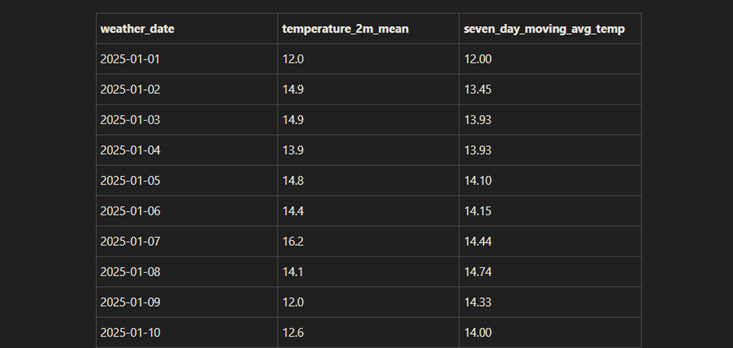

# Santa Barbara Weather Data Pipeline

## Project Overview

This project is a beginner-friendly end-to-end data engineering pipeline that extracts historical weather data for Santa Barbara, California, transforms the raw API response into a clean tabular dataset, loads the processed data into a PostgreSQL database, and analyzes the data using SQL.

The purpose of this project is to practice core data engineering skills:

- Python scripting
- API extraction
- JSON processing
- Data cleaning with pandas
- PostgreSQL database loading
- SQL analysis
- SQL views
- Git/GitHub project organization

## Data Source

The data comes from the Open-Meteo historical weather API.

The pipeline extracts daily weather observations for Santa Barbara for the year 2025, including:

- Maximum temperature
- Minimum temperature
- Mean temperature
- Precipitation
- Maximum wind speed

## Pipeline Architecture

```text
Open-Meteo API
      ↓
src/extract.py
      ↓
data/raw/weather_raw.json
      ↓
src/transform.py
      ↓
data/processed/weather_daily.csv
      ↓
src/load.py
      ↓
PostgreSQL table: weather_daily
      ↓
SQL analysis queries and monthly summary view
```

## How to Run the Project

1. Clone the repository.

```powershell
git clone https://github.com/jhoncastaneda816/santa-barbara-weather-pipeline.git
cd santa-barbara-weather-pipeline
```

2. Create and activate a virtual environment.

```powershell
python -m venv .venv
.\.venv\Scripts\Activate.ps1
```

3. Install dependencies.

```powershell
python -m pip install -r requirements.txt
```

4. Create a .env file with your PostgreSQL credentials.

DB_HOST=localhost
DB_PORT=5432
DB_NAME=weather_pipeline
DB_USER=postgres
DB_PASSWORD=your_password_here

5. Run the table creation SQL in PostgreSQL.

```powershell
sql/create_tables.sql
```

6. Run the full pipeline.

```powershell
python src\run_pipeline.py
```

## Database Table

The main PostgreSQL table is weather_daily.

| Column                | Description                        |
|-----------------------|------------------------------------|
| `weather_date`        | Date of the weather observation    |
| `temperature_2m_max`  | Daily maximum temperature          |
| `temperature_2m_min`  | Daily minimum temperature          |
| `temperature_2m_mean` | Daily mean temperature             |
| `precipitation_sum`   | Daily total precipitation          |
| `wind_speed_10m_max`  | Daily maximum wind speed           |
| `loaded_at`           | Timestamp when the data was loaded |

## Example Outputs

### Compare each day to the previous day



### Rank days by maximum temperature



### Seven-day moving average temperature

